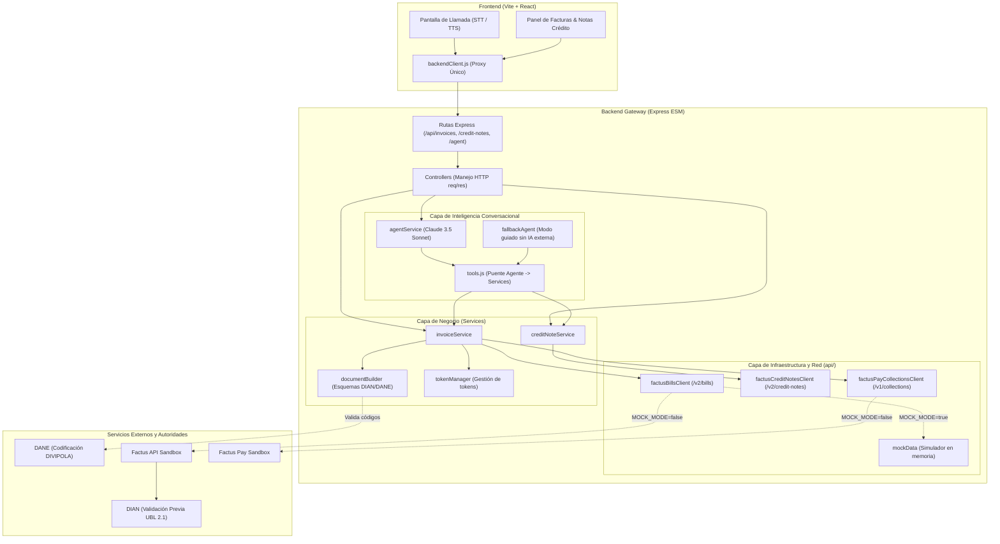

# Factus Voz: Arquitectura del Sistema y Matriz de Evaluación

Este documento presenta la arquitectura de software de **Factus Voz**, su justificación técnica y el desglose de cumplimiento frente a los **Criterios de Evaluación** oficiales del evento/hackathon.

---

## 1. Matriz de Cumplimiento de Criterios de Evaluación

A continuación se detalla cómo el proyecto aborda y maximiza cada uno de los rubros de evaluación:

```
┌───────────────────────────────────────┬───────┬────────────────────────────────────────────────────────┐
│ Criterio de Evaluación                │ Pts % │ Estrategia y Cumplimiento en Factus Voz                │
├───────────────────────────────────────┼───────┼────────────────────────────────────────────────────────┤
│ 1. Integración de APIs                │  25%  │ • Consumo completo de Factus API v2 y Factus Pay v1.   │
│                                       │       │ • Flujo OAuth2 y TokenManager con auto-refresh.        │
│                                       │       │ • Validación DIAN síncrona (CUFE, QR, XML UBL 2.1).    │
│                                       │       │ • Orquestación automática Factura -> Factus Pay.       │
│                                       │       │ • Integración con Catálogos Oficiales DANE (DIVIPOLA). │
├───────────────────────────────────────┼───────┼────────────────────────────────────────────────────────┤
│ 2. Funcionamiento                     │  25%  │ • Ciclo de vida completo: Creación, consulta y         │
│                                       │       │   eliminación/anulación de facturas y notas crédito.   │
│                                       │       │ • Modo Híbrido: MOCK_MODE para testing sin saldo y     │
│                                       │       │   modo Producción/Sandbox real con Factus.             │
│                                       │       │ • Manejo de errores resiliente con ApiError y fallback.│
├───────────────────────────────────────┼───────┼────────────────────────────────────────────────────────┤
│ 3. Calidad del Código y Arquitectura  │  15%  │ • Arquitectura en capas desacopladas (Clean Arch).     │
│                                       │       │ • La capa de red (api/) no conoce reglas de negocio.   │
│                                       │       │ • DocumentBuilder aísla los cambios de esquema DIAN.   │
│                                       │       │ • Colección Postman completa y documentación OpenAPI.  │
├───────────────────────────────────────┼───────┼────────────────────────────────────────────────────────┤
│ 4. Innovación                         │  15%  │ • Agente de Voz con IA (Speech-to-Text -> LLM -> TTS). │
│                                       │       │ • Facturación conversacional "hands-free" sin teclear. │
│                                       │       │ • Resolución semántica de municipios DANE DIVIPOLA.    │
│                                       │       │ • Fallback algorítmico guiado si no hay API key de IA. │
├───────────────────────────────────────┼───────┼────────────────────────────────────────────────────────┤
│ 5. Experiencia de Usuario (UX)        │  10%  │ • Interfaz moderna estilo llamada con animaciones.     │
│                                       │       │ • Feedback sonoro y transcripción en tiempo real.      │
│                                       │       │ • Panel de historial con badges DIAN y botón de pago.  │
│                                       │       │ • Accesibilidad: soporte alternativo por teclado.      │
├───────────────────────────────────────┼───────┼────────────────────────────────────────────────────────┤
│ 6. Presentación y Material            │  10%  │ • Pitch estructurado de 3 minutos para los jurados.    │
│                                       │       │ • Documentación exhaustiva en /docs (flujos, APIs).    │
│                                       │       │ • Diagramas Mermaid de secuencia y arquitectura.       │
│                                       │       │ • Colección Postman lista para pruebas de evaluación.  │
└───────────────────────────────────────┴───────┴────────────────────────────────────────────────────────┘
```

---

## 2. Diagrama de Arquitectura de Capas (Clean Architecture)

El sistema sigue una separación estricta de responsabilidades en 5 niveles:



---

## 3. Guion de Pitch y Demostración para Jurados (3 Minutos)

Para lograr la máxima calificación en **Presentación (10%)** y **Innovación (15%)**, se sugiere seguir este guion exacto de exposición:

### Minuto 0:00 - 0:45 | El Problema y la Oportunidad
> *"Buenas tardes, jurados. En Colombia, emitir una factura electrónica ante la DIAN y registrar los códigos del DANE para un comerciante o profesional suele ser un proceso engorroso: formularios con más de 20 campos, códigos DIVIPOLA confusos y la molestia de tener que pasar a otra pantalla para cobrar.
> Les presentamos **Factus Voz**: la primera solución que convierte la facturación electrónica y el recaudo digital en una simple llamada telefónica asistida por inteligencia artificial."*

### Minuto 0:45 - 2:00 | Demostración en Vivo (Live Demo)
1. **Inicio de llamada:** El presentador toca el botón 📞 de llamada.
2. **Interacción por voz:**
   - *Presentador:* "Hola, necesito hacer una factura a nombre de Carlos Rodríguez, cédula 901234567 en Medellín, por 2 asesorías tributarias a 150 mil pesos cada una".
   - *Agente responde (por voz):* Transcribe, procesa, mapea "Medellín" al código DANE `05001`, calcula el IVA al 19% ($57,000) y el total ($357,000). Pide confirmación de pago.
   - *Presentador:* "De contado, por transferencia".
   - *Agente:* "Confirmado. Generando factura electrónica y recaudo... ¡Listo! Factura SETP9900001001 validada por la DIAN con CUFE generado y link de pago activo en Factus Pay".
3. **Comprobación en Pantalla:** Aparece inmediatamente en el panel derecho la tarjeta con el CUFE, enlace de validación DIAN y enlace de pago de Factus Pay.
4. **Demostración del dilema legal (Eliminar vs Anular):**
   - El presentador muestra cómo el sistema distingue técnicamente: si el documento fuera borrador, se elimina físicamente con `DELETE /v2/bills/destroy`; como ya está validado por la DIAN, el sistema protege al usuario orientándolo a emitir la Nota Crédito correspondiente según la norma DIAN.

### Minuto 2:00 - 3:00 | Arquitectura, Stakeholders y Cierre
> *"Bajo el capó, Factus Voz implementa una arquitectura limpia y desacoplada:
> 1. Integra las dos APIs de la suite: **Factus API v2** para timbrado DIAN y **Factus Pay** para recaudo inmediato.
> 2. Articula al **DANE** mediante el estándar DIVIPOLA de codificación municipal y a la **DIAN** con el estándar UBL 2.1.
> 3. Pone al **Comprador** en el centro del flujo, entregándole su factura con CUFE y su QR de pago en un solo toque.
> Factus Voz no es solo un dashboard más; es el futuro de la facturación conversacional en Colombia. Muchas gracias."*
