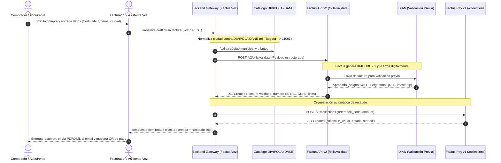
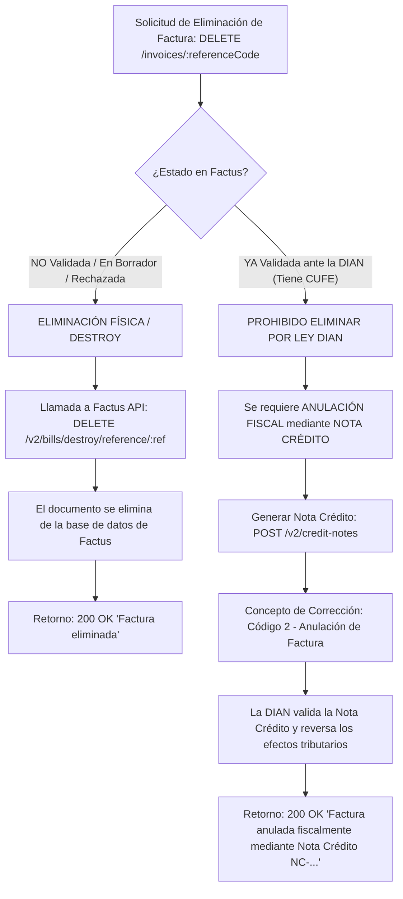
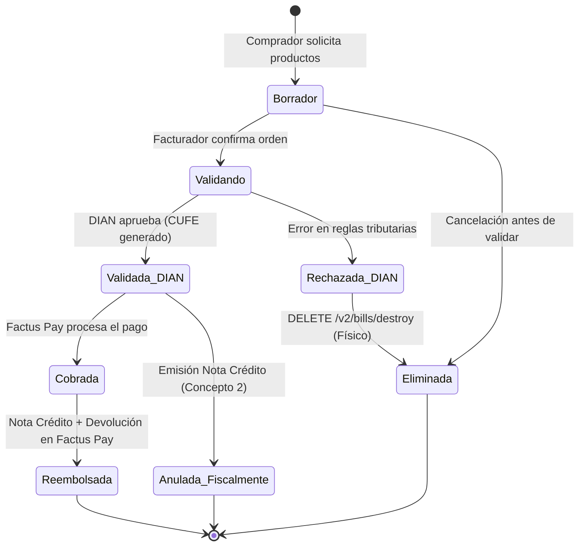

# Factus Voz: Stakeholders y Flujo de Trabajo

Este documento define la estructura de actores clave (**Stakeholders**), el rol fundamental del **DANE** y la **DIAN**, el modelado del **Comprador** como iniciador del flujo comercial, y los diagramas de secuencia y flujo de estados del sistema para la creación, recaudo y eliminación/anulación de facturas electrónicas.

---

## 1. Identificación y Matriz de Stakeholders

En el ecosistema de facturación electrónica en Colombia convergen entidades gubernamentales, plataformas tecnológicas, comercios y ciudadanos.

| Stakeholder | Tipo de Actor | Rol Principal | Interés / Valor Recibido | Relación con la API / Sistema |
|---|---|---|---|---|
| **DANE** (Depto. Administrativo Nacional de Estadística) | Gubernamental / Estadístico | Entidad que regula la codificación geográfica (**DIVIPOLA**) y actividades económicas (**CIIU**). | Monitoreo en tiempo real de la economía nacional (IPC, ISE, PIB, comercio minorista) a través del cruce de datos fiscales con la DIAN. | Proveedor del catálogo de municipios (`municipality_code`) y departamentos. La API de Factus valida que cada factura cumpla con la codificación oficial DANE DIVIPOLA. |
| **DIAN** (Dirección de Impuestos y Aduanas Nacionales) | Gubernamental / Fiscal | Máxima autoridad tributaria y fiscal en Colombia. | Control de evasión, recaudo de IVA (19%, 5%, 0%), trazabilidad de transacciones comerciales. | Validador síncrono del documento electrónico XML (UBL 2.1). Genera el **CUFE** (Código Único de Facturación Electrónica), firma digital y código QR. |
| **Comprador / Adquirente** | Usuario Final / Iniciador | Persona natural o jurídica que adquiere los bienes o servicios. | Recibir un comprobante fiscal legal (PDF y XML con validez DIAN), agilidad en la atención y facilidades de pago digital. | Suministra datos de identificación (Cédula/NIT, nombre, correo, municipio DANE) y realiza el pago mediante Factus Pay. |
| **Facturador / Emisor (Comercio / Vendedor)** | Operativo / Negocio | Empresa, profesional independiente o comerciante que realiza la venta. | Facturar sin fricción administrativa, evitar digitación manual repetitiva, cobrar más rápido y cumplir la ley DIAN sin sanciones. | Usuario principal de la interfaz de voz o REST API. Dicta o envía los datos de la venta y autoriza la emisión. |
| **Factus API** | Proveedor Tecnológico Autorizado | Plataforma API intermediaria certificada ante la DIAN. | Proveer infraestructura RESTful para emisión, validación, timbrado y custodia de facturas electrónicas y notas crédito. | Recibe el payload JSON en `/v2/bills/validate`, construye el XML UBL 2.1, lo firma, lo transmite a la DIAN y retorna el CUFE y PDF. |
| **Factus Pay** | Pasarela Financiera / Recaudos | Plataforma de cobros y recaudos electrónicos. | Centralizar los pagos de las facturas emitidas, conciliación automática y dispersión de fondos. | Recibe la orden de cobro en `/v1/collections`, genera el link de pago y código QR transaccional con el mismo `reference_code`. |

---

## 2. El Rol Estratégico del DANE en la Facturación Electrónica

### ¿Por qué el DANE es un Stakeholder Fundamental?
A menudo se asocia la facturación electrónica únicamente con la DIAN; sin embargo, en Colombia el **DANE** es un actor indispensable en dos dimensiones:

1. **Estandarización Geográfica (DIVIPOLA):**
   - El DANE es el custodio de la **División Político-Administrativa de Colombia (DIVIPOLA)**.
   - Cada municipio colombiano posee un código oficial de 5 dígitos (ejemplo: `11001` para Bogotá D.C., `05001` para Medellín, `76001` para Cali, `08001` para Barranquilla).
   - La API de Factus (por mandato técnico de la DIAN) **exige obligatoriamente** el campo `customer.municipality_code` referenciado al estándar DIVIPOLA del DANE.
   - En **Factus Voz**, el sistema resuelve automáticamente el nombre común de la ciudad (ej: "Bogotá", "Medellín") mapeándolo al código numérico oficial DANE DIVIPOLA sin obligar al usuario a memorizar códigos numéricos.

2. **Impacto Macroeconómico e Inteligencia Estadística:**
   - Mediante el convenio interinstitucional DIAN - DANE, los datos agregados y anonimizados de facturación electrónica alimentan en tiempo real:
     * El **Índice de Precios al Consumidor (IPC)** (medición de la inflación).
     * El **Indicador de Seguimiento a la Economía (ISE)**.
     * La **Encuesta Mensual de Comercio al por Menor (EMCM)**.
   - La emisión precisa de facturas con identificación de municipios DANE y tarifas de IVA contribuye directamente a la calidad de la estadística económica del país.

---

## 3. Persona que Inicia el Flujo: El Comprador (Adquirente)

### Modelado del Comprador
El comprador es el disparador de la necesidad transaccional. Puede interactuar en dos modalidades:

```
[ Modalidad 1: Venta Asistida en Punto de Venta (POS) ]
Comprador (Físico/Presencial) ---> Vendedor (Usa Factus Voz) ---> Factus & Factus Pay

[ Modalidad 2: Autoservicio / Kiosco Interactivo ]
Comprador (Habla directamente con el Agente) ---> Factus & Factus Pay
```

### El Viaje del Comprador (Customer Journey)
1. **Intención de Compra:** El comprador solicita uno o más productos o servicios indicando cantidades o especificaciones.
2. **Suministro de Datos Fiscales:**
   - Persona Natural: Cédula de Ciudadanía (`13`), nombres, correo electrónico para recepción de factura.
   - Persona Jurídica: NIT (`31`), razón social, correo de facturación electrónica.
   - Ubicación: Ciudad de residencia/facturación (asociada al DANE DIVIPOLA).
   - Consumidor Final: En compras menores donde el comprador no requiera factura nominada, se aplica la regla de cuantías menores (`222222222222`).
3. **Validación de la Orden:** El comprador escucha/visualiza el resumen (subtotal, IVA correspondiente del 19%, 5% o 0%, y total a pagar).
4. **Emisión y Entrega:**
   - El sistema emite la factura electrónica con validación previa de la DIAN.
   - El comprador recibe en su correo el archivo comprimido (.zip) con el PDF gráfico y el XML UBL 2.1 con su respectivo CUFE.
5. **Experiencia de Pago:**
   - Se le presenta un enlace seguro o código QR de **Factus Pay** para pagar vía PSE, tarjetas o billeteras digitales.

---

## 4. Flujo de Trabajo (Workflows) y Diagramas de Secuencia

### 4.1 Flujo Principal: Creación y Cobro de Factura Electrónica

Este diagrama describe la secuencia síncrona desde que el comprador inicia la compra hasta la validación DIAN y registro en Factus Pay:



---

### 4.2 Flujo Crítico: ¿Eliminar o Anular una Factura? (El Dilema Legal Colombiano)

En Colombia existe una distinción técnica y regulatoria fundamental establecida por la DIAN (Decreto 358 de 2020 y Resolución 000042):



#### Regla de Negocio Implementada:
1. **Destrucción (`destroy`):** Solo es admisible mientras la factura no haya adquirido valor fiscal ante la DIAN.
2. **Anulación (`credit-note` concepto 2):** Si la factura ya fue timbrada y cuenta con CUFE, el sistema no la "borra" de la base de datos (lo que constituiría una infracción tributaria), sino que orquesta la emisión de una **Nota Crédito de Anulación Total**, garantizando el 100% de cumplimiento legal.

---

## 5. Matriz de Estados de la Factura


